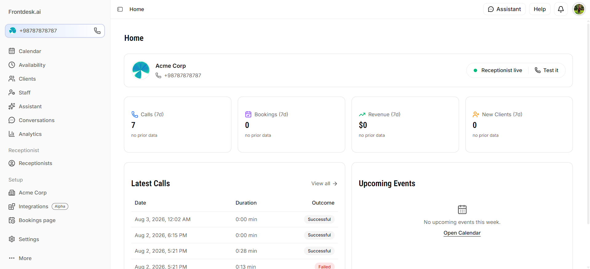
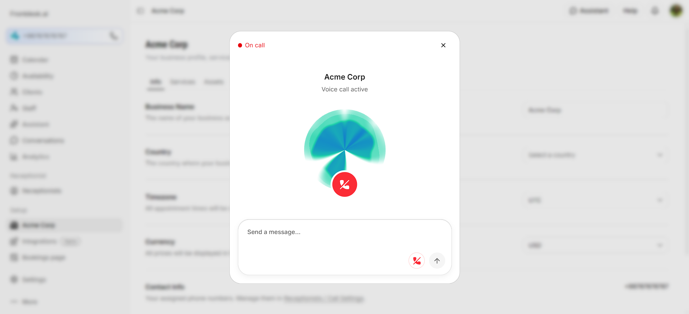
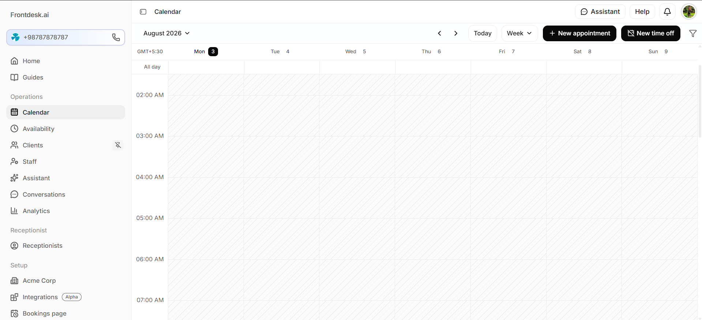
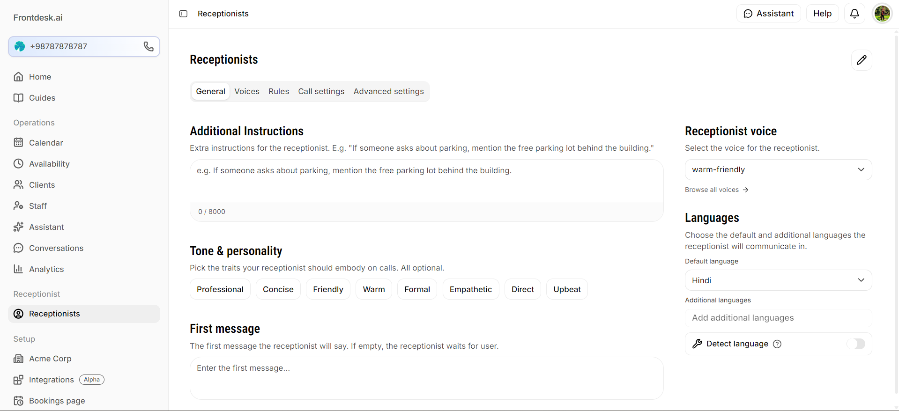
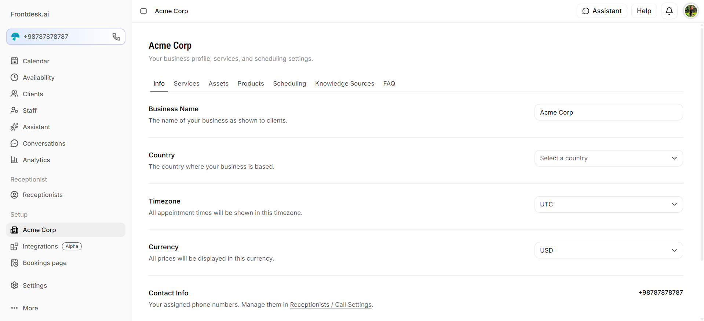
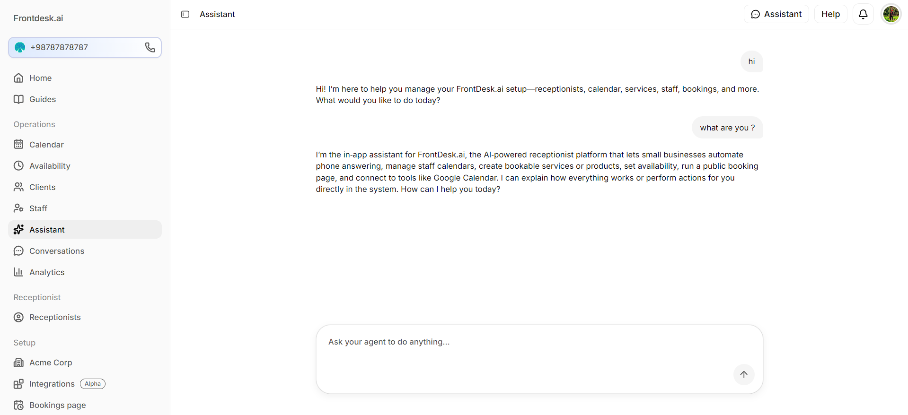

# Frontdesk.ai

An open-source, self-hostable AI receptionist platform. Frontdesk.ai answers calls, books appointments, and manages your business's front desk — an original implementation inspired by products like ElevenLabs' Reception.ai, built to be free, transparent, and self-hostable.

> **Branding:** the *Frontdesk.ai* wordmark uses the [Bitcount Prop Single](https://fonts.google.com/) Google Font.

## Screenshots








## Features

- **AI receptionist agents** — configurable voice/chat agents with custom greetings, tone, languages, and call-routing rules
- **Live web calls** — talk to your receptionist directly in the browser (LiveKit + Groq + Fish Audio), with a real-time transcript
- **Website-aware setup** — scan a business website to auto-fill business info, services, and knowledge sources
- **Calendar & bookings** — appointments, staff/asset availability, business-hours-aware scheduling
- **Public booking page** — a per-organization public page (`/book/[slug]`) where customers can view services and start a call
- **Clients & staff management** — CRM-lite records tied to your organization
- **Conversations** — call transcripts, AI-generated summaries, and outcome tracking
- **Analytics** — call volume, bookings, revenue, and conversion tracking
- **Integrations** — calendar sync, CRM, and webhook/automation connectors
- **Multi-tenant orgs** — Supabase-backed auth and row-level-security-scoped organizations

## Tech Stack

- **Framework:** [Next.js 16](https://nextjs.org) (App Router, Server Actions)
- **Database & Auth:** [Supabase](https://supabase.com) (Postgres + Row Level Security)
- **Queue / background jobs:** [BullMQ](https://docs.bullmq.io) + [Redis](https://redis.io) (website scans and other async jobs — not the call pipeline)
- **Voice transport:** [LiveKit](https://livekit.io) (real-time rooms, browser ↔ agent worker)
- **STT / LLM:** [Groq](https://groq.com) (Whisper for speech-to-text, Llama for the conversation engine)
- **TTS:** [Fish Audio](https://fish.audio) for text-to-speech
- **UI:** Tailwind CSS v4, shadcn/ui (on [Base UI](https://base-ui.com)), [Lucide](https://lucide.dev) icons
- **Testing:** Vitest

## Getting Started

### Prerequisites

- Node.js 20+
- [pnpm](https://pnpm.io) (`npm install -g pnpm` if you don't have it)
- A [Supabase](https://supabase.com) project (or the Supabase CLI for local development)
- A Redis instance (local via Docker, or a hosted provider)
- A [LiveKit](https://livekit.io) project (LiveKit Cloud or self-hosted)
- API keys for [Groq](https://console.groq.com) and [Fish Audio](https://fish.audio)

### Setup

1. Clone the repo and install dependencies:

   ```bash
   git clone https://github.com/<your-org>/frontdesk-ai.git
   cd frontdesk-ai
   pnpm install
   ```

2. Copy the environment template and fill in your credentials:

   ```bash
   cp .env.example .env.local
   ```

3. Apply database migrations:

   ```bash
   npx supabase db push
   ```

4. Start the dev server:

   ```bash
   pnpm dev
   ```

5. In separate terminals, start the background workers:

   ```bash
   # Website scans and other queued jobs (BullMQ)
   pnpm worker

   # Voice agent — joins LiveKit rooms and runs the STT/LLM/TTS pipeline for live calls
   pnpm worker:voice
   ```

6. Open [http://localhost:3000](http://localhost:3000).

### Environment variables

All variables live in `.env.local` (see `.env.example` for the full template).

| Variable | Used for |
| --- | --- |
| `NEXT_PUBLIC_SUPABASE_URL` | Supabase project URL |
| `NEXT_PUBLIC_SUPABASE_PUBLISHABLE_KEY` | Supabase anon/publishable key (browser + session-scoped server reads) |
| `SUPABASE_SECRET_KEY` | Supabase service-role key (server-only, bypasses RLS — workers and privileged server actions) |
| `NEXT_PUBLIC_SITE_URL` | Base URL of the app, e.g. `http://localhost:3000` |
| `REDIS_URL` | Redis connection string for BullMQ (website-scan worker, rate limiting) |
| `GROQ_API_KEY` | Groq API key — used for both STT (Whisper) and the conversation LLM |
| `LIVEKIT_URL` | LiveKit server WebSocket URL (`wss://...`) — used by the browser client, server actions, and the voice worker |
| `LIVEKIT_API_KEY` / `LIVEKIT_API_SECRET` | LiveKit API credentials for minting tokens and creating rooms server-side |
| `FISH_AUDIO_API_KEY` | Fish Audio API key for text-to-speech |

### Scripts

| Command | Description |
| --- | --- |
| `pnpm dev` | Start the Next.js dev server |
| `pnpm build` | Production build |
| `pnpm start` | Start the production server |
| `pnpm lint` | Run ESLint |
| `pnpm test` | Run the Vitest test suite once |
| `pnpm test:watch` | Run tests in watch mode |
| `pnpm worker` | Run the background job worker (BullMQ — website scans, etc.) |
| `pnpm worker:voice` | Run the voice agent worker (joins LiveKit rooms for live calls) |

## How calling works

There's no message queue in the call path — it's a direct real-time pipeline over LiveKit, not a BullMQ job:

1. The browser calls a server action (`startDashboardCall` / `startPublicCall`), which mints a LiveKit token and creates a LiveKit room (with the agent + conversation IDs in its metadata), and inserts a `conversations` row.
2. The browser connects directly to LiveKit over WebRTC.
3. The voice worker (`pnpm worker:voice`) is registered with LiveKit as an agent and gets dispatched into the room the moment the caller joins.
4. Inside the room: Groq Whisper (STT) → Groq LLM (conversation + tool calling) → Fish Audio (TTS), orchestrated by `@livekit/agents`.
5. On hangup, the worker writes the final conversation record (duration, outcome, transcript) back to Supabase.

BullMQ + Redis is used elsewhere in the app (the website-scan worker, rate limiting) but not for calls themselves — LiveKit's own dispatch mechanism handles that.

## Architecture

- `app/` — Next.js App Router routes, grouped by `(auth)` and `(dashboard)` route groups, plus a standalone `onboarding` flow and the public `book/[slug]` booking page
- `components/` — UI components (`components/ui` is the vendored shadcn/Base UI layer; feature components live in their own folders, e.g. `components/voice/`)
- `lib/` — data access (`lib/data`), validation schemas (`lib/validations`), Supabase clients (`lib/supabase`), the crawler and LLM provider code, voice adapters (`lib/voice`), and the BullMQ queue setup (`lib/queue`)
- `workers/` — standalone Node processes that run outside the Next.js request lifecycle: the BullMQ job consumer and the LiveKit voice agent
- `supabase/migrations/` — SQL migrations, applied via the Supabase CLI

## Contributing

Contributions are welcome. See [CONTRIBUTING.md](./CONTRIBUTING.md) for setup details, coding conventions, and how to submit changes.

## License

Licensed under the [Apache License 2.0](./LICENSE).
