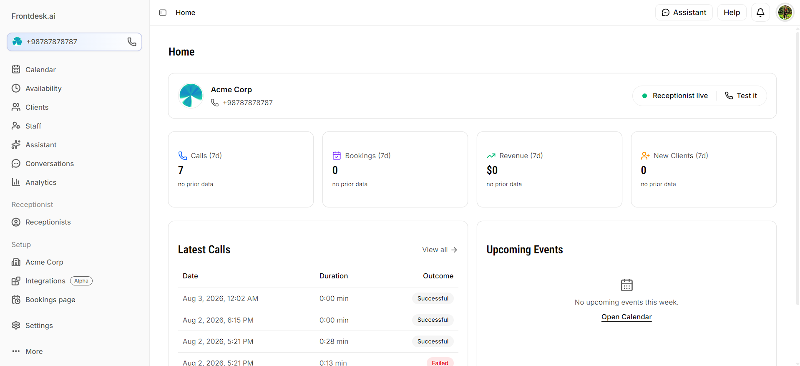
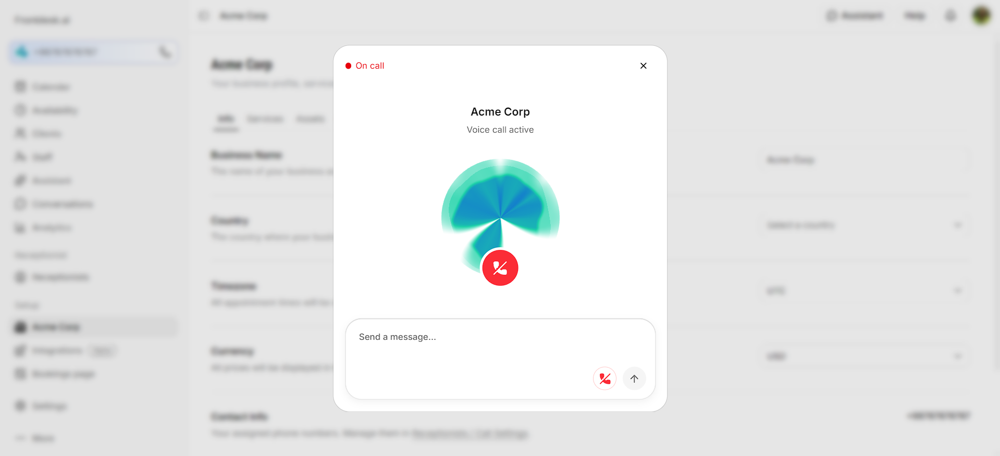
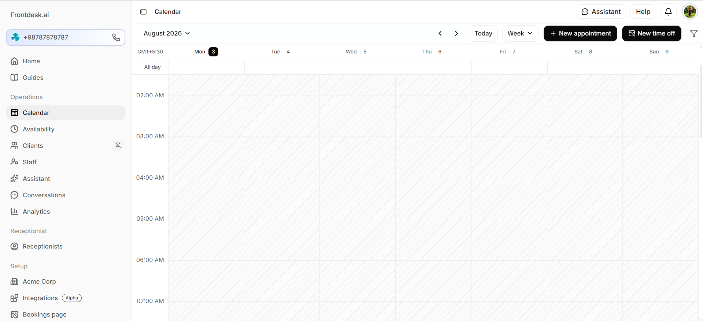
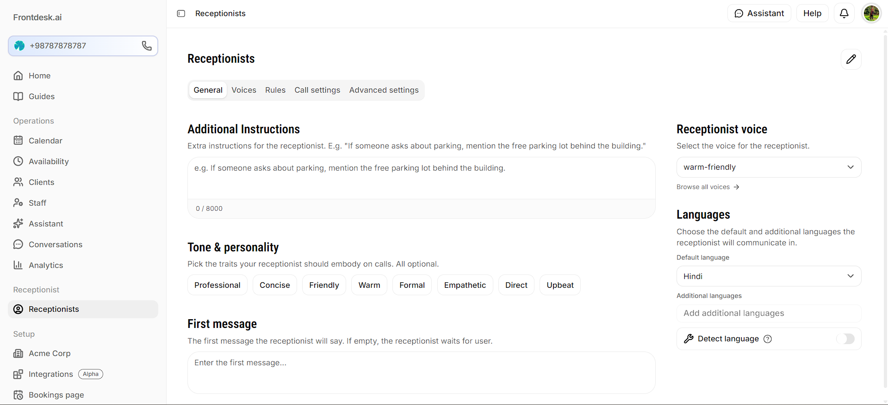
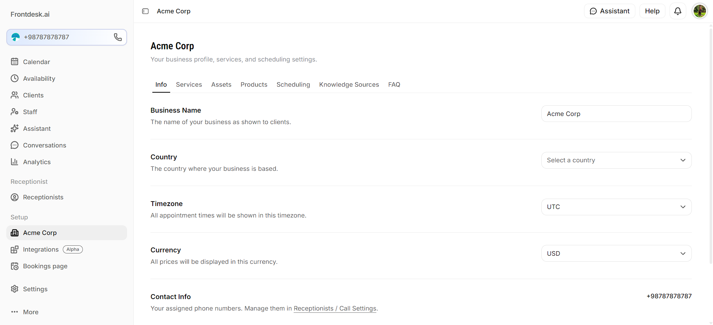
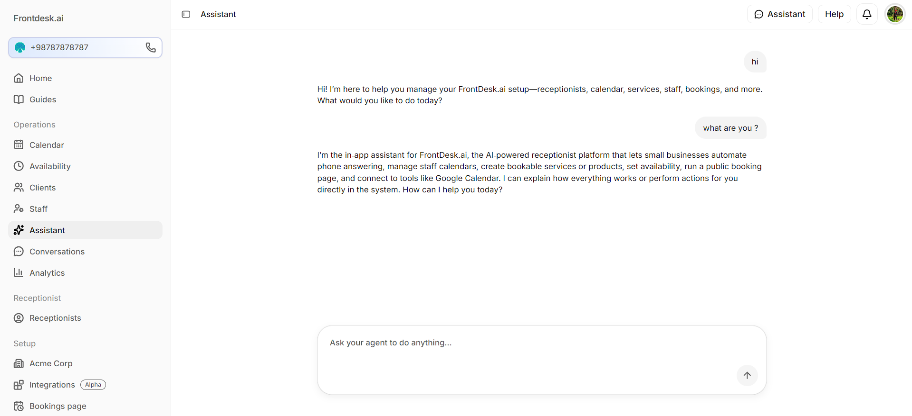
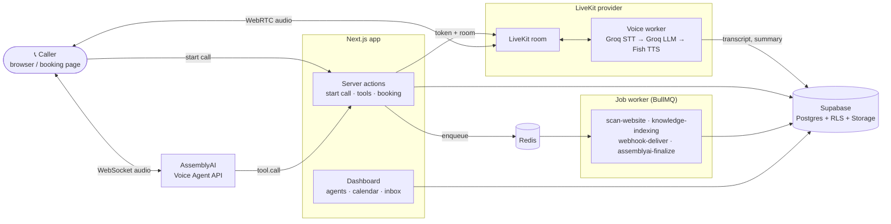

<div align="center">

<picture>
  <source media="(prefers-color-scheme: dark)" srcset="./public/brand/frontdesk-logo-light.svg">
  
</picture>

<h3>The open-source AI receptionist.</h3>

<p>Answers every call, books the appointment, and remembers the details.<br/>Self-host it, read every line, own your data.</p>

<p>
  <a href="./LICENSE"></a>
  <a href="https://nextjs.org"></a>
  <a href="https://supabase.com"></a>
  <a href="https://livekit.io"></a>
  <a href="./CONTRIBUTING.md"></a>
  <a href="https://github.com/Sainigurnoor511/frontdesk-ai/stargazers"></a>
</p>

<p>
  <a href="#-quick-start"><b>Quick start</b></a> ·
  <a href="./developer-docs/ARCHITECTURE.md"><b>Docs</b></a> ·
  <a href="#-roadmap"><b>Roadmap</b></a> ·
  <a href="https://github.com/Sainigurnoor511/frontdesk-ai/issues/new?labels=bug"><b>Report a bug</b></a> ·
  <a href="https://github.com/Sainigurnoor511/frontdesk-ai/issues/new?labels=enhancement"><b>Request a feature</b></a>
</p>



</div>

---

## Table of contents

- [About](#-about)
- [Features](#-features)
- [Screenshots](#-screenshots)
- [How it works](#-how-it-works)
- [Tech stack](#-tech-stack)
- [Quick start](#-quick-start)
  - [Option A: Docker](#option-a-docker-recommended)
  - [Option B: Local Node](#option-b-local-node)
- [Configuration](#-configuration)
- [Scripts](#-scripts)
- [Project structure](#-project-structure)
- [Deployment](#-deployment)
- [Testing & quality](#-testing--quality)
- [Roadmap](#-roadmap)
- [FAQ](#-faq)
- [Contributing](#-contributing)
- [Security](#-security)
- [Support & community](#-support--community)
- [Acknowledgements](#-acknowledgements)
- [License](#-license)

---

## 📖 About

**Frontdesk.ai** is an open-source, self-hostable AI receptionist for small and medium businesses: clinics, salons, studios, agencies, repair shops, anyone whose phone rings while their hands are busy.

You create a receptionist, point it at your website, and it learns your services, hours, and FAQs. It answers callers in a natural voice, checks real availability, books appointments into your calendar, and leaves you a transcript, a recording, and a summary of every conversation.

It is an original implementation inspired by commercial products such as ElevenLabs' Reception.ai, with three differences that matter:

| | Frontdesk.ai |
| --- | --- |
| **Open** | Apache-2.0. Every prompt, tool, and data flow is in this repo. |
| **Self-hostable** | One `docker compose up`. Your Postgres, your Redis, your keys. |
| **Pluggable** | Swap voice engines per agent; bring your own LLM, TTS, and calendar. |

> [!NOTE]
> Frontdesk.ai is in active early development (`v0.1`). Expect breaking changes between releases. See the [roadmap](#-roadmap) for what is stable and what is not.

---

## ✨ Features

### Voice receptionist

- **Configurable agents**: greeting, tone, language (or auto-detect), LLM model and reasoning effort, background-speech filtering, and structured *"When X, do Y"* rules
- **Two voice engines, chosen per agent**
  - **LiveKit pipeline** (default): Groq Whisper STT → Groq LLM → Fish Audio TTS with Silero VAD, run by your own worker
  - **AssemblyAI Voice Agent**: one managed WebSocket for STT, LLM, TTS, and turn detection
- **Live web calls**: talk to your receptionist in the browser with a real-time transcript
- **Tools on the call**: checks availability, books appointments, and searches your knowledge base mid-conversation
- **Recordings and summaries**: every call is recorded, transcribed, summarized, and given an outcome

### Business brain

- **Website scan**: paste a URL and Frontdesk.ai crawls it (respecting `robots.txt`) to fill in your business profile, services, and knowledge
- **Knowledge base**: upload PDF, DOCX, Markdown, HTML, or text files, write FAQs; answers come from hybrid vector + full-text search with local embeddings (no embedding API key needed)
- **In-app assistant**: a chat assistant that can set up agents, services, hours, and appointments for you

### Scheduling

- **Calendar**: appointments, staff hours, time off, exceptions, and a live "available now" view
- **Availability engine**: slots respect business hours, staff overrides, time off, existing bookings, notice periods, and booking windows
- **Public booking page** at `/smb/[slug]`: themes, templates, custom media, an embed snippet, and self-serve book / reschedule / cancel flows, protected by Cloudflare Turnstile
- **Confirmation emails** via Resend

### Operations

- **Conversations inbox**: transcripts with synced audio playback and click-to-seek, summaries, outcomes, read state, filters
- **Analytics**: call volume, bookings, revenue, and conversion
- **Clients and staff**: lightweight CRM records tied to every call and booking
- **Phone numbers**: provision and assign numbers per agent, block unwanted callers

### Integrations

- **Calendars**: Google Calendar, Microsoft Outlook, Cal.com, Calendly
- **Telephony**: Twilio number provisioning (Plivo and SIP trunking planned)
- **Outbound webhooks**: HMAC-signed (`X-Frontdesk-Signature`) events delivered with retries for your own automations

### Platform

- **Multi-tenant**: organizations and members isolated by Postgres row-level security
- **Auth**: email/password, Google OAuth, TOTP two-factor, sign out of all devices
- **Self-host friendly**: standalone Next.js build, Docker images, one worker process for all background jobs

---

## 📸 Screenshots

<table>
  <tr>
    <td width="50%"><p align="center"><sub><b>Live call</b> with real-time transcript</sub></p></td>
    <td width="50%"><p align="center"><sub><b>Calendar</b> with staff availability</sub></p></td>
  </tr>
  <tr>
    <td width="50%"><p align="center"><sub><b>Receptionists</b>: voice, model, rules</sub></p></td>
    <td width="50%"><p align="center"><sub><b>Business</b> profile and knowledge</sub></p></td>
  </tr>
  <tr>
    <td colspan="2"><p align="center"><sub><b>Assistant</b>: set up your front desk by chatting</sub></p></td>
  </tr>
</table>

---

## ⚙️ How it works


```mermaid
flowchart LR
    Caller(["📞 Caller<br/>browser / booking page"])

    subgraph App["Next.js app"]
        Actions["Server actions<br/>start call · tools · booking"]
        Dash["Dashboard<br/>agents · calendar · inbox"]
    end

    subgraph LK["LiveKit provider"]
        Room["LiveKit room"]
        Voice["Voice worker<br/>Groq STT → Groq LLM → Fish TTS"]
    end

    AAI["AssemblyAI<br/>Voice Agent API"]

    subgraph Jobs["Job worker (BullMQ)"]
        Q["scan-website · knowledge-indexing<br/>webhook-deliver · assemblyai-finalize"]
    end

    DB[("Supabase<br/>Postgres + RLS + Storage")]
    Redis[("Redis")]

    Caller -->|start call| Actions
    Actions -->|token + room| Room
    Caller <-->|WebRTC audio| Room
    Room <--> Voice
    Caller <-->|WebSocket audio| AAI
    AAI -->|tool.call| Actions
    Voice -->|transcript, summary| DB
    Actions --> DB
    Actions -->|enqueue| Redis
    Redis --> Q
    Q --> DB
    Dash --> DB
```

1. A caller starts a call from the dashboard or the public booking page. A server action creates the `conversations` row and returns credentials for the agent's voice provider.
2. **LiveKit agents**: the browser joins a LiveKit room and the voice worker is dispatched into it. **AssemblyAI agents**: the browser streams straight to AssemblyAI.
3. When the model wants to check a slot, book, or look something up, the same provider-neutral tool handlers run, validated with Zod and scoped to the caller's organization.
4. On hangup the transcript, recording, summary, and outcome land in Supabase, and your webhooks fire.

The full walkthrough lives in [developer-docs/ARCHITECTURE.md](./developer-docs/ARCHITECTURE.md#voice-pipeline).

---

## 🧰 Tech stack

| Layer | Technology |
| --- | --- |
| Framework | [Next.js 16](https://nextjs.org) (App Router, Server Actions, standalone output), React 19 |
| Database, auth, storage | [Supabase](https://supabase.com) (Postgres + Row Level Security + Storage + MFA) |
| Background jobs | [BullMQ](https://docs.bullmq.io) on [Redis](https://redis.io) |
| Real-time voice | [LiveKit](https://livekit.io) + [`@livekit/agents`](https://docs.livekit.io/agents/) |
| Managed voice | [AssemblyAI Voice Agent API](https://www.assemblyai.com) |
| Speech-to-text, LLM | [Groq](https://groq.com) (Whisper, open-weight chat models) |
| Text-to-speech | [Fish Audio](https://fish.audio) |
| Embeddings | [FastEmbed](https://github.com/Anush008/fastembed-js) (local BGE, 384-dim) + Postgres full-text |
| UI | Tailwind CSS v4, [shadcn/ui](https://ui.shadcn.com) on [Base UI](https://base-ui.com), [Lucide](https://lucide.dev), Motion |
| Email, bot protection | [Resend](https://resend.com), Cloudflare Turnstile |
| Testing | [Vitest](https://vitest.dev) |
| Packaging | pnpm, Docker, nginx |

---

## 🚀 Quick start

### Prerequisites

| You need | Notes |
| --- | --- |
| Node.js 20+ and [pnpm](https://pnpm.io) | `corepack enable pnpm`. Docker images use Node 22. |
| A [Supabase](https://supabase.com) project | Hosted, or local via the Supabase CLI |
| Redis | Bundled in Docker Compose; any Redis 7 for local Node |
| A [LiveKit](https://livekit.io) project | LiveKit Cloud or self-hosted, plus the [`lk` CLI](https://docs.livekit.io/home/cli/) for local voice dev |
| API keys | [Groq](https://console.groq.com) and [Fish Audio](https://fish.audio) (required); AssemblyAI, Resend, Turnstile, calendar OAuth (optional) |

### Option A: Docker (recommended)

```bash
git clone https://github.com/Sainigurnoor511/frontdesk-ai.git
cd frontdesk-ai
cp .env.example .env.local          # fill in your keys
npx supabase db push                # apply migrations to your Supabase project
docker compose --env-file .env.local up --build
```

Open **http://localhost**. Compose starts:

| Service | What it runs |
| --- | --- |
| `nginx` | Reverse proxy on port **80** |
| `app` | Next.js production server |
| `redis` | Redis 7 for BullMQ |
| `worker-jobs` | Every background queue: website scans, knowledge indexing, webhooks, AssemblyAI transcripts |
| `worker-voice` | LiveKit voice agent |

Stop with `docker compose down`. Rebuild after code changes with the same `up --build` command.

### Option B: Local Node

```bash
git clone https://github.com/Sainigurnoor511/frontdesk-ai.git
cd frontdesk-ai
pnpm install
cp .env.example .env.local          # set REDIS_URL=redis://localhost:6379/0
npx supabase db push
```

Then run each process in its own terminal:

```bash
pnpm dev          # web app on http://localhost:3000
pnpm dev:jobs     # background job worker (all queues)
pnpm dev:voice    # LiveKit voice worker
```

### Smoke test

After startup, check that:

1. The assistant streams a reply on `/assistant`.
2. An onboarding website scan moves `pending → running → completed`.
3. Adding an FAQ or knowledge file triggers indexing.
4. A browser call joins, transcribes, and appears in **Conversations** after hangup.
5. Webhook events reach your endpoint, if configured.

---

## 🔧 Configuration

All configuration is environment variables in `.env.local`. [`.env.example`](./.env.example) is the annotated template; the [architecture guide](./developer-docs/ARCHITECTURE.md#environment-variables) says which process reads each one.

<details>
<summary><b>Show all environment variables</b></summary>

| Variable | Required | Purpose |
| --- | --- | --- |
| `NEXT_PUBLIC_SUPABASE_URL` | ✅ | Supabase project URL |
| `NEXT_PUBLIC_SUPABASE_PUBLISHABLE_KEY` | ✅ | Supabase publishable (anon) key |
| `SUPABASE_SECRET_KEY` | ✅ | Service-role key for workers and privileged server code. Never expose it to the browser. |
| `NEXT_PUBLIC_SITE_URL` | ✅ | Public base URL, e.g. `http://localhost:3000` |
| `REDIS_URL` | ✅ | Redis connection for BullMQ |
| `GROQ_API_KEY` | ✅ | STT, conversation LLM, extraction, assistant |
| `LIVEKIT_URL`, `LIVEKIT_API_KEY`, `LIVEKIT_API_SECRET` | ✅ | LiveKit rooms, tokens, webhooks |
| `FISH_AUDIO_API_KEY` | ✅ | Text-to-speech |
| `ENCRYPTION_KEY` | For calendars | Encrypts stored OAuth tokens (AES-256-GCM) |
| `SUPABASE_STORAGE_S3_ENDPOINT`, `_REGION`, `_ACCESS_KEY`, `_SECRET_KEY` | For recordings | Where LiveKit egress writes call recordings |
| `ASSEMBLYAI_API_KEY` | For AssemblyAI agents | Managed voice provider |
| `ASSEMBLYAI_WEBHOOK_SECRET` | Optional | Verifies AssemblyAI `session.completed` webhooks |
| `GROQ_ASSISTANT_MODEL` | Optional | Model override for the in-app assistant |
| `FASTEMBED_MODEL`, `FASTEMBED_DISABLED` | Optional | Embedding model; `FASTEMBED_DISABLED=1` for lexical-only search |
| `FISH_AUDIO_TTS_STREAMING` | Optional | `1` enables streaming TTS |
| `WORKER_QUEUES` | Optional | Run only some queues in a job worker, e.g. `knowledge-indexing` |
| `NEXT_PUBLIC_TURNSTILE_SITE_KEY`, `TURNSTILE_SECRET_KEY` | Optional | Bot protection on the public booking page |
| `RESEND_API_KEY`, `RESEND_FROM_EMAIL` | Optional | Appointment confirmation emails |
| `GOOGLE_CALENDAR_OAUTH_CLIENT_ID`, `_SECRET` | Optional | Google Calendar sync |
| `MICROSOFT_CALENDAR_CLIENT_ID`, `_SECRET`, `_TENANT_ID` | Optional | Microsoft Calendar sync |

</details>

---

## 📜 Scripts

| Command | Description |
| --- | --- |
| `pnpm dev` | Next.js dev server |
| `pnpm build` | Production build (standalone output) |
| `pnpm start` | Run the production build |
| `pnpm dev:jobs` / `pnpm start:jobs` | Background job worker, watch mode / production |
| `pnpm dev:voice` / `pnpm start:voice` | LiveKit voice worker, dev (`lk agent dev`) / production |
| `pnpm test` / `pnpm test:watch` | Vitest, once / watch |
| `pnpm lint` | ESLint |
| `pnpm exec tsc --noEmit` | Typecheck |

---

## 🗂️ Project structure

```
frontdesk-ai/
├── app/                    # Next.js App Router
│   ├── (auth)/             #   login, signup, OAuth callback
│   ├── (dashboard)/        #   agents, calendar, conversations, analytics, booking-page editor, …
│   ├── (settings)/         #   account + organization settings
│   ├── onboarding/         #   website scan → first receptionist
│   ├── smb/[slug]/         #   public booking page
│   └── api/                #   assistant stream, recordings, OAuth + provider webhooks
├── components/             # UI (components/ui = vendored shadcn on Base UI)
├── lib/
│   ├── data/               # data access, org-scoped
│   ├── validations/        # Zod schemas
│   ├── voice/              # prompts, tools, LiveKit adapters, AssemblyAI provider
│   ├── knowledge/          # chunking, file extraction, hybrid search
│   ├── integrations/       # calendars, telephony, webhooks
│   ├── queue/              # BullMQ queues + processors
│   └── supabase/           # browser / server / service-role clients
├── workers/                # jobs.ts (all queues), voice-agent.ts (LiveKit)
├── supabase/migrations/    # numbered SQL migrations
├── public/brand/           # logo files
└── developer-docs/         # architecture guide, team backlog
```

---

## ☁️ Deployment

Two deployment modes are documented and supported today:

1. **Docker Compose** on any Linux host or VM (full app plus all workers)
2. **Local Node runtime** on Windows, macOS, or Linux (full app plus all workers)

Serverless-only hosting (for example, Vercel alone) is **not** supported for full functionality, because the voice worker and job worker are long-running processes. You can host the web app on a serverless platform and run `worker-jobs` and `worker-voice` elsewhere, but that setup is not documented yet.

Production checklist:

- [ ] Apply every migration (`npx supabase db push`). The included GitHub Action does this on merge to `main`.
- [ ] Run **both** workers. Without `worker-jobs`, scans never finish and AssemblyAI calls never get transcripts.
- [ ] Point LiveKit's webhook at `/api/webhooks/livekit` so recordings attach to conversations.
- [ ] Set `ENCRYPTION_KEY` before connecting any calendar, and never rotate it without re-connecting.
- [ ] Put the app behind HTTPS; browsers require a secure context for microphone access.

---

## 🧪 Testing & quality

```bash
pnpm test                 # Vitest unit + component tests
pnpm exec tsc --noEmit    # typecheck
pnpm exec eslint <files>  # lint what you changed
```

Tests live next to the code they cover (`*.test.ts` / `*.test.tsx`). Server actions and data helpers are tested for validation failures, success paths, and organization scoping. A handful of known pre-existing failures are tracked in the [architecture guide](./developer-docs/ARCHITECTURE.md#known-baseline-2026-10-08).

---

## 🗺️ Roadmap

**Shipped**

- [x] Voice receptionist on LiveKit (Groq + Fish Audio) with recordings, transcripts, summaries
- [x] AssemblyAI Voice Agent as a per-agent alternative engine
- [x] Booking and knowledge tools on live calls
- [x] Website scan, knowledge base, FAQs with hybrid search
- [x] Public booking page with themes, templates, embed, reschedule/cancel
- [x] Google, Microsoft, Cal.com, Calendly calendar sync
- [x] Phone number provisioning, agent rules, language auto-detect, TOTP 2FA

**Next**

- [ ] Inbound phone calls (Twilio / Plivo → LiveKit SIP)
- [ ] Cancel and reschedule tools on voice calls
- [ ] Answering modes and call routing enforcement
- [ ] Enforce two-factor at login
- [ ] Notification delivery and a notification center
- [ ] End-to-end and load tests
- [ ] Billing and plans for hosted deployments

The detailed backlog lives in [developer-docs/TODO.md](./developer-docs/TODO.md). Have an idea? [Open a feature request](https://github.com/Sainigurnoor511/frontdesk-ai/issues/new?labels=enhancement).

---

## ❓ FAQ

<details>
<summary><b>Can it answer real phone calls?</b></summary>

Not yet. Today calls happen in the browser, from the dashboard or your public booking page. Phone numbers can already be provisioned through Twilio; routing inbound PSTN calls into LiveKit via SIP is the top roadmap item.
</details>

<details>
<summary><b>Which voice engine should I choose?</b></summary>

**LiveKit** (default) gives you full control: you run the worker, pick the Groq model, and choose from Fish Audio voices in many languages. **AssemblyAI** is fully managed with no worker to run, but it currently speaks only English, Spanish, German, French, Portuguese, and Italian. You can mix both across agents.
</details>

<details>
<summary><b>Can I use OpenAI, Anthropic, or another LLM?</b></summary>

The LiveKit worker uses `@livekit/agents-plugin-openai`, which speaks any OpenAI-compatible API, and Groq is wired in through it. Swapping providers is a code change in `workers/voice-agent.ts` today; a configurable provider setting is welcome as a contribution.
</details>

<details>
<summary><b>Does my data leave my server?</b></summary>

Your database, recordings, and embeddings stay in your Supabase project and your infrastructure. Audio and text are sent to the providers you configure (LiveKit, Groq, Fish Audio, AssemblyAI) to run the conversation. Embeddings are computed locally with FastEmbed.
</details>

<details>
<summary><b>Is it production ready?</b></summary>

It is `v0.1` and moving fast. It's suitable for pilots and self-hosters comfortable reading logs; pin a commit and test upgrades before rolling them out.
</details>

---

## 🤝 Contributing

Contributions of every size are welcome: bug reports, docs, translations, tests, and features.

1. Read [CONTRIBUTING.md](./CONTRIBUTING.md) for setup and coding conventions.
2. Look for an open issue, or open one to discuss bigger changes first.
3. Fork, branch from `main`, keep commits focused, and open a pull request.

Please follow our [Code of Conduct](./CODE_OF_CONDUCT.md) in all project spaces.

<a href="https://github.com/Sainigurnoor511/frontdesk-ai/graphs/contributors">
  
</a>

---

## 🔒 Security

Please **do not** open public issues for security vulnerabilities. Report them privately through [GitHub Security Advisories](https://github.com/Sainigurnoor511/frontdesk-ai/security/advisories/new). We aim to acknowledge reports within a few days.

Frontdesk.ai's security model:

- Every organization-scoped query resolves the caller's organization on the server; client-supplied org IDs are never trusted.
- Postgres row-level security isolates tenants at the database layer.
- Model-generated tool arguments are validated with Zod before any write.
- Calendar OAuth tokens are encrypted at rest; LiveKit and AssemblyAI webhooks are signature-verified.

---

## 💬 Support & community

- **Questions and ideas**: [GitHub Discussions](https://github.com/Sainigurnoor511/frontdesk-ai/discussions)
- **Bugs**: [GitHub Issues](https://github.com/Sainigurnoor511/frontdesk-ai/issues)
- **Docs**: [Architecture guide](./developer-docs/ARCHITECTURE.md)

If Frontdesk.ai is useful to you, a ⭐ on GitHub helps others find it.

[](https://star-history.com/#Sainigurnoor511/frontdesk-ai&Date)

---

## 🙏 Acknowledgements

Frontdesk.ai stands on great open-source work and services, including [Next.js](https://nextjs.org), [Supabase](https://supabase.com), [LiveKit Agents](https://github.com/livekit/agents-js), [BullMQ](https://bullmq.io), [shadcn/ui](https://ui.shadcn.com), [Base UI](https://base-ui.com), [FastEmbed](https://github.com/Anush008/fastembed-js), and [Lucide](https://lucide.dev). Voice and language by [Groq](https://groq.com), [Fish Audio](https://fish.audio), and [AssemblyAI](https://www.assemblyai.com).

The logo is drawn in the dot-matrix style of [Bitcount Prop Single](https://fonts.google.com/specimen/Bitcount+Prop+Single) (SIL Open Font License). The mark is a lowercase **f** and **d** sharing one stem.

---

## 📄 License

Frontdesk.ai is licensed under the [Apache License 2.0](./LICENSE).

<div align="center">
<br/>
<picture>
  <source media="(prefers-color-scheme: dark)" srcset="./public/brand/frontdesk-mark-light.svg">
  
</picture>
<br/>
<sub>Built in the open. Your front desk, your code.</sub>
</div>
